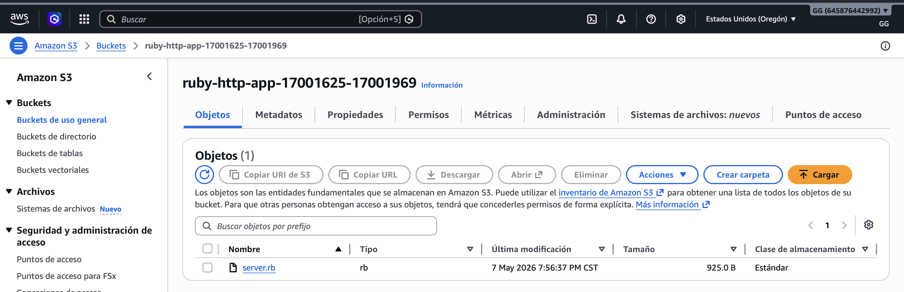
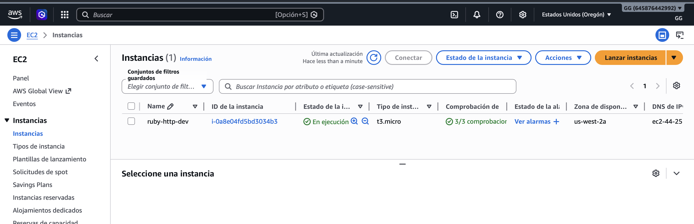

# Terraform EC2 Ruby HTTP Server Module

This repository provisions a single EC2 instance that runs a Ruby HTTP server with two endpoints:
- `GET /health`
- `POST /echo`

## Prerequisites

- AWS credentials configured locally
- Terraform CLI >= 1.8
- An S3 bucket to host app/server.rb
- Your public IP address in CIDR form

## Setup

1. Upload [app/server.rb](app/server.rb) to your S3 bucket.
2. Update [infra/envs/dev/dev.tfvars](infra/envs/dev/dev.tfvars) with:
   - `app_s3_bucket`
   - `allowed_cidr_blocks`
   - `ami_id` and `instance_type` if you need the arm64 option
3. Run Terraform:

```bash
terraform -chdir=infra init
terraform -chdir=infra apply -var-file=envs/dev/dev.tfvars
```

## Evidence

### Instance

```
-----------------------------------------------------
|                 DescribeInstances                 |
+----------------------+----------+-----------------+
|  i-0a8e04fd5bd3034b3 |  running |  44.251.54.146  |
+----------------------+----------+-----------------+
```

### Health Check

```bash
curl http://44.251.54.146:8080/health
# Output: {"status":"ok","compute":"ec2"}
# Expected: {"compute":"ec2","status":"ok"}
```

### Echo

```bash
curl -X POST http://44.251.54.146:8080/echo \
  -H 'Content-Type: application/json' -d '{"msg":"hello"}'
# Output: {"msg":"hello","compute":"ec2"}
# Expected: {"compute":"ec2","msg":"hello"}
```

## Teardown

```bash
terraform -chdir=infra destroy -var-file=envs/dev/dev.tfvars
```

## AWS Console




